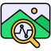
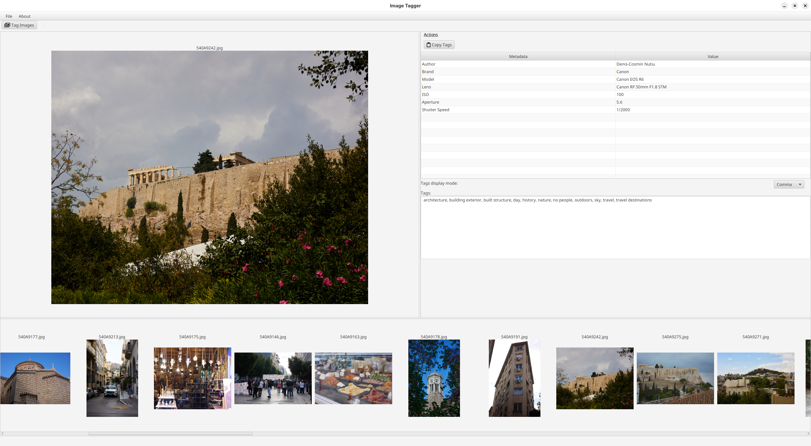

#  Image Tagger

Image Tagger is a simple software application for predicting an image's keywords using a deep learning model based on
resnet.

It allows photographers to automate the image tagging process. 📸

---

## Instructions

1. Download a release from the release page.
2. Unzip the release.
3. Run `ImageTagger\image\bin\ImageTagger`.



Photo credit: [https://unsplash.com/@ndcphoto](https://unsplash.com/@ndcphoto)

Alternatively see [Flatpak](./flatpak/readme.md) installation instructions.

## Development

If you want to build the application yourself, you will need Java 17 JDK and the
AI models available in the AIModels release.

The release archive is in the [releases page](https://github.com/dnutiu/ImageTagger/releases).

Note: On Linux desktop related features (opening images, folders) are handled
via [xdg-open](https://linux.die.net/man/1/xdg-open).

### Building and Running from source

To build from source you will need Java 17 JDK and Gradle.

Due to some GitHub limitations that do not allow me to upload large files, you'll need to download the AIModels
zip file which contains the deep learning models and place them into the
`ImageTagger/img-ai/src/main/resources/dev/nuculabs/imagetagger/ai/` path.

To build the project run:

```bash
gradlew build
```

To run:

```bash
gradlew run
```

### Building the Flatpak

To build the Flatpak run the following commands:

```shell
cd flatpak
./build.sh
```

It will build the flatpak using the latest sources from this repo.

### Building a package (Fedora Example)

To build a package run

```shell
gradle jpackage <<< "--type rpm"
```

To install and run the application:

```shell
dnf install ./img-ui/build/jpackage/imagetagger-1.0-1.x86_64.rpm
/opt/imagetagger/bin/ImageTagger
```

# Blog

You can visit my tech blog at [https://blog.nuculabs.dev](https://blog.nuculabs.dev).

# Credits

- Icons: <a href="https://www.flaticon.com/free-icons/image-analysis" title="image analysis icons">Image analysis icons
  created by Dewi Sari - Flaticon</a>
  